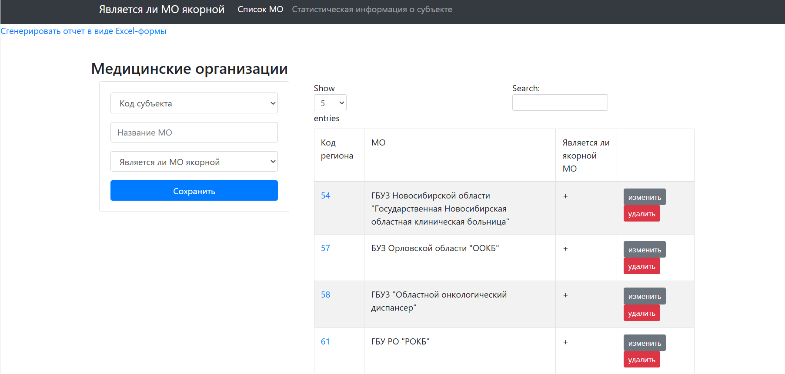

# base_mo
Система управления статистической информацией по медицинским организациям
# Название проекта

**Система управления медицинскими организациями и статистической информацией**

## Описание проекта

Данный проект представляет собой веб-приложение, разработанное на Flask, которое позволяет пользователям управлять и получать информацию о медицинских организациях и статистических данных. Система подключается к базе данных PostgreSQL и предоставляет функционал для работы с данными, включая их визуализацию, экспорт в Excel, а также выполнение CRUD-операций.

## Основные функции

- **Управление медицинскими организациями**:
  - Добавление, редактирование, удаление и просмотр информации о медицинских организациях.
  - Экспорт данных о медицинских организациях в формате Excel.

- **Управление статистической информацией**:
  - Добавление, редактирование, удаление и просмотр статистической информации о регионах.
  - Экспорт статистических данных в формате Excel.

- **Статистика по картам**:
  - Просмотр статистики по картам, закодированным в формате Base64.

- **Интеграция с базой данных**:
  - Широкие возможности работы с PostgreSQL для хранения и извлечения данных.

## Используемые технологии

- **Backend**:
  - Python 3.10
  - Flask

- **База данных**:
  - PostgreSQL

- **Frontend**:
  - HTML/CSS (с использованием шаблонов Flask)

- **Библиотеки**:
  - psycopg2 для подключения к базе данных
  - xlwt для генерации файлов Excel

## Установка

1. Склонируйте репозиторий:

   ```bash
   git clone https://github.com/kingston45-dev/base_mo.git
   ```

2. Перейдите в директорию проекта:

   ```bash
   cd base_mo
   ```

3. Настройте базу данных:
   - Установите PostgreSQL.
   - Создайте базу данных с необходимой структурой (см. раздел "Структура базы данных").
   - Настройте файл конфигурации `.env` для хранения учетных данных:

     ```env
     DB_HOST=localhost
     DB_NAME=base1
     DB_USER=your_username
     DB_PASS=your_password
     ```

   - Убедитесь, что библиотека `python-dotenv` установлена:

     ```bash
     pip install python-dotenv
     ```

4. Установите необходимые библиотеки Python:

   ```bash
   pip install -r requirements.txt
   ```

5. Запустите Flask-приложение:

   ```bash
   python app.py
   ```

6. Откройте приложение в браузере по адресу `http://127.0.0.1:5000/`.

## Структура базы данных

Приложение использует базу данных PostgreSQL для хранения информации о медицинских организациях и статистических данных.

### Таблицы базы данных

1. **mo** — информация о медицинских организациях:
   - `id_subject` (INTEGER): Код субъекта РФ.
   - `mo_name` (TEXT): Название медицинской организации.
   - `anchoring` (CHAR): Признак якорности медицинской организации (`+` или `-`).
   - `year` (INTEGER): Год, к которому относится запись.

2. **stat_info** — статистическая информация по регионам:
   - `id_subject` (INTEGER): Код субъекта РФ.
   - `subject_rf` (TEXT): Название субъекта РФ.
   - `year` (INTEGER): Год.
   - `population_all` (INTEGER): Общее население.
   - `population_adult` (INTEGER): Взрослое население.
   - `population_city` (INTEGER): Городское население.
   - `population_country` (INTEGER): Сельское население.
   - `max_distance` (FLOAT): Максимальная удаленность до ближайшей медицинской организации.

3. **maps_stat** — информация для отображения карт:
   - `id_subject` (INTEGER): Код субъекта РФ.
   - `map_stat` (BYTEA): Закодированное изображение карты в формате Base64.

### Пример SQL-скрипта

```sql
-- Таблица для медицинских организаций
CREATE TABLE mo (
    id_subject INTEGER PRIMARY KEY,
    mo_name TEXT NOT NULL,
    anchoring CHAR(1) NOT NULL,
    year INTEGER NOT NULL
);

-- Таблица для статистической информации
CREATE TABLE stat_info (
    id_subject INTEGER,
    subject_rf TEXT NOT NULL,
    year INTEGER,
    population_all INTEGER,
    population_adult INTEGER,
    population_city INTEGER,
    population_country INTEGER,
    max_distance FLOAT,
    PRIMARY KEY (id_subject, year)
);

-- Таблица для данных по картам
CREATE TABLE maps_stat (
    id_subject INTEGER PRIMARY KEY,
    map_stat BYTEA
);
```

### Пример данных

```sql
-- Таблица mo
INSERT INTO mo (id_subject, mo_name, anchoring, year) VALUES
(1, 'Городская больница №1', '+', 2023),
(2, 'Поликлиника №3', '-', 2023);

-- Таблица stat_info
INSERT INTO stat_info (id_subject, subject_rf, year, population_all, population_adult, population_city, population_country, max_distance) VALUES
(1, 'Московская область', 2023, 7500000, 5200000, 6300000, 1200000, 50.5);

-- Таблица maps_stat
INSERT INTO maps_stat (id_subject, map_stat) VALUES
(1, DECODE('...', 'base64'));
```

## Структура папок

```
.
├── app.py                 # Flask-приложение
├── templates/             # HTML-шаблоны
│   ├── index.html         # Главная страница
│   ├── edit.html          # Шаблон редактирования МО
│   ├── stat.html          # Шаблон для статистической информации
│   └── ...
├── static/                # Статические файлы (CSS, JS, изображения)
├── requirements.txt       # Зависимости Python
└── README.md              # Документация проекта
```

## Использование

### Управление медицинскими организациями
- Перейдите на главную страницу для просмотра списка медицинских организаций.
- Используйте кнопку "Добавить" для создания новой записи.
- Редактируйте или удаляйте существующие записи по необходимости.

### Работа со статистической информацией
- Просматривайте данные статистики в соответствующем разделе.
- Обновляйте или удаляйте записи для определенных лет и регионов.

### Экспорт данных
- Нажмите на кнопку экспорта для скачивания данных в формате Excel.

### Ссылки на документацию

- Документация Flask: https://flask.palletsprojects.com/

- Документация psycopg2: https://www.psycopg.org/docs/


# base_mo
Management System for Statistical Information on Medical Organizations

# Project Name

**Management System for Medical Organizations and Statistical Information**

## Project Description

This project is a web application developed using Flask that allows users to manage and retrieve information about medical organizations and statistical data. The system connects to a PostgreSQL database and provides functionality for data operations, including visualization, Excel export, and CRUD operations.

## Key Features

- **Management of Medical Organizations**:
  - Add, edit, delete, and view information about medical organizations.
  - Export data on medical organizations in Excel format.

- **Statistical Information Management**:
  - Add, edit, delete, and view statistical information about regions.
  - Export statistical data in Excel format.

- **Map Statistics**:
  - View map statistics encoded in Base64 format.

- **Database Integration**:
  - Extensive PostgreSQL capabilities for data storage and retrieval.

## Technologies Used

- **Backend**:
  - Python 3.10
  - Flask

- **Database**:
  - PostgreSQL

- **Frontend**:
  - HTML/CSS (using Flask templates)

- **Libraries**:
  - `psycopg2` for database connection
  - `xlwt` for generating Excel files

## Installation

1. Clone the repository:

   ```bash
   git clone https://github.com/kingston45-dev/base_mo.git
   ```

2. Navigate to the project directory:

   ```bash
   cd base_mo
   ```

3. Set up the database:
   - Install PostgreSQL.
   - Create a database with the required structure (see the "Database Structure" section).
   - Configure the `.env` file for storing credentials:

     ```env
     DB_HOST=localhost
     DB_NAME=base1
     DB_USER=your_username
     DB_PASS=your_password
     ```

   - Ensure the `python-dotenv` library is installed:

     ```bash
     pip install python-dotenv
     ```

4. Install the required Python libraries:

   ```bash
   pip install -r requirements.txt
   ```

5. Run the Flask application:

   ```bash
   python app.py
   ```

6. Open the application in a browser at `http://127.0.0.1:5000/`.



## Database Structure

The application uses a PostgreSQL database to store information about medical organizations and statistical data.

### Database Tables

1. **mo** — Information about medical organizations:
   - `id_subject` (INTEGER): Subject code of the Russian Federation.
   - `mo_name` (TEXT): Name of the medical organization.
   - `anchoring` (CHAR): Indicator of whether the organization is an anchor (`+` or `-`).
   - `year` (INTEGER): Year associated with the record.

2. **stat_info** — Statistical information by region:
   - `id_subject` (INTEGER): Subject code of the Russian Federation.
   - `subject_rf` (TEXT): Name of the Russian Federation subject.
   - `year` (INTEGER): Year.
   - `population_all` (INTEGER): Total population.
   - `population_adult` (INTEGER): Adult population.
   - `population_city` (INTEGER): Urban population.
   - `population_country` (INTEGER): Rural population.
   - `max_distance` (FLOAT): Maximum distance to the nearest medical organization.

3. **maps_stat** — Information for map display:
   - `id_subject` (INTEGER): Subject code of the Russian Federation.
   - `map_stat` (BYTEA): Encoded map image in Base64 format.

### Example SQL Script

```sql
-- Table for medical organizations
CREATE TABLE mo (
    id_subject INTEGER PRIMARY KEY,
    mo_name TEXT NOT NULL,
    anchoring CHAR(1) NOT NULL,
    year INTEGER NOT NULL
);

-- Table for statistical information
CREATE TABLE stat_info (
    id_subject INTEGER,
    subject_rf TEXT NOT NULL,
    year INTEGER,
    population_all INTEGER,
    population_adult INTEGER,
    population_city INTEGER,
    population_country INTEGER,
    max_distance FLOAT,
    PRIMARY KEY (id_subject, year)
);

-- Table for map data
CREATE TABLE maps_stat (
    id_subject INTEGER PRIMARY KEY,
    map_stat BYTEA
);
```

### Example Data

```sql
-- Table mo
INSERT INTO mo (id_subject, mo_name, anchoring, year) VALUES
(1, 'City Hospital No. 1', '+', 2023),
(2, 'Polyclinic No. 3', '-', 2023);

-- Table stat_info
INSERT INTO stat_info (id_subject, subject_rf, year, population_all, population_adult, population_city, population_country, max_distance) VALUES
(1, 'Moscow Region', 2023, 7500000, 5200000, 6300000, 1200000, 50.5);

-- Table maps_stat
INSERT INTO maps_stat (id_subject, map_stat) VALUES
(1, DECODE('...', 'base64'));
```

## Folder Structure

```
.
├── app.py                 # Flask application
├── templates/             # HTML templates
│   ├── index.html         # Main page
│   ├── edit.html          # Template for editing organizations
│   ├── stat.html          # Template for statistical information
│   └── ...
├── static/                # Static files (CSS, JS, images)
├── requirements.txt       # Python dependencies
└── README.md              # Project documentation
```

## Usage

### Managing Medical Organizations
- Navigate to the homepage to view the list of medical organizations.
- Use the "Add" button to create a new record.
- Edit or delete existing records as needed.

### Working with Statistical Information
- View statistical data in the respective section.
- Update or delete records for specific years and regions.

### Exporting Data
- Click the export button to download data in Excel format.

## Acknowledgments

- Flask documentation: https://flask.palletsprojects.com/
- psycopg2 documentation: https://www.psycopg.org/docs/
